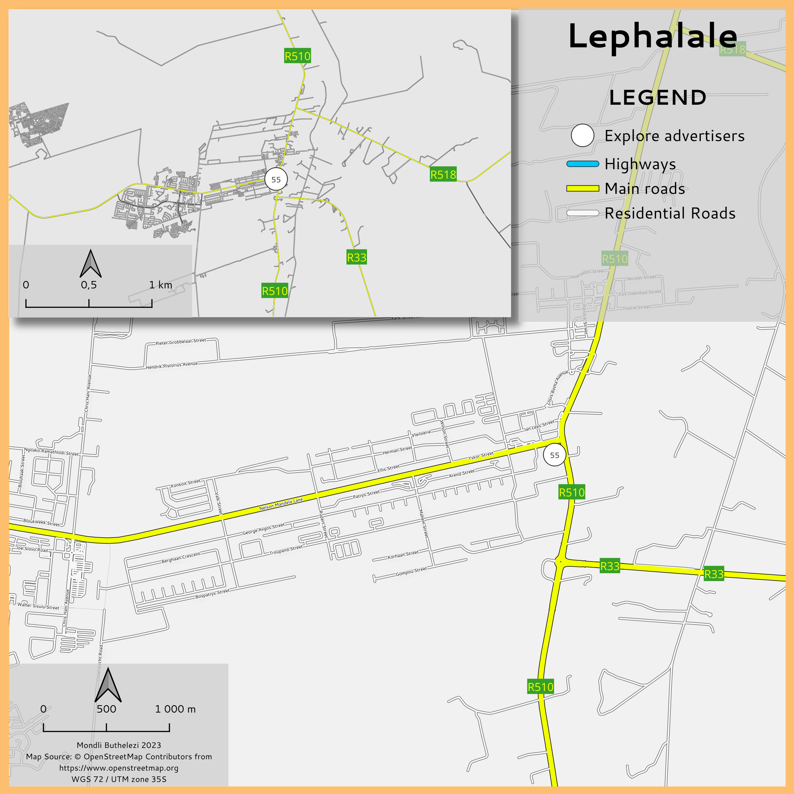

# Django Class-Based Views for Equipment Type Management
- ## EquipmentTypeView
- This view retrieves all equipment types from the database and renders them in a template for display.
- The `get()` method fetches all `EquipmentType` objects using `EquipmentType.objects.all()` and passes them to the template for rendering.
- ## EditEquipmentTypeView
- This view handles the editing of an existing equipment type.
- The `get()` method fetches an existing `EquipmentType` instance based on the provided `pk` (primary key) and populates an `EquipmentTypeForm` instance with the retrieved data.
- The `post()` method processes the form data upon submission, validates it, and updates the corresponding `EquipmentType` instance if valid. It then redirects back to the equipment type list view.
- ## DeleteEquipmentTypeView
- This view handles the deletion of an existing equipment type.
- The `get()` method fetches an existing `EquipmentType` instance based on the provided `pk` and renders a confirmation template.
- The `post()` method confirms the deletion and redirects back to the equipment type list view after successfully deleting the instance.
- ## AddEquipmentTypeView
- This view handles the addition of a new equipment type.
- The `get()` method renders a form template for adding a new equipment type.
- The `post()` method processes the form data upon submission, validates it, and creates a new `EquipmentType` instance if valid. It then redirects back to the equipment type list view.
- ## EquipmentTypeForm
- This form class is a subclass of `forms.ModelForm` specifically designed for the `EquipmentType` model.
- The `Meta` class specifies the model to use and the fields to exclude from the form (e.g., `last_update`).
- The `widgets` attribute configures the rendering of form fields. In this case, it sets the `last_update` field as read-only using the `readonly` attribute.
- ## Usage
- These views collectively facilitate Create, Read, Update, and Delete operations for `EquipmentType` records using Class-Based Views in Django.
- The views utilize the `EquipmentTypeForm` to manage form rendering and data validation.
- Make sure to integrate these views into your Django project's URL routing to access them.
- ## Note
- Ensure that you adjust model names, URLs, and templates to match your project's structure and naming conventions.
-
- {:height 646, :width 638}
- # Spatial Analysis Instructions and Questions
- ## Instructions Overview
- ### Finalized Components
  By this point, you should have finalized the following components:
  1. Digitized points representing various features.
  2. Completed forms for data collection.
  3. Styling applied to enhance the visual presentation of your data.
- ### Spatial Analysis Tasks
  For this submission, you'll be conducting spatial analysis on your collected data points to answer specific questions:
  
  1. **Points per Category:** Determine the number of collected points for each category. Document your analysis steps in Logseq.
  
  2. **Polygon Area per Category:** Calculate the individual and total area of polygons for each category.
  
  3. **Line Length per Category:** Calculate the individual and total length of line features for each category.
  
  4. **Most Isolated Point:** Identify the most isolated point per category. Research how to find isolated points in QGIS.
  
  5. **Dominant Type:** Determine the most dominant type, such as the most frequently reported land use area, vegetation type, electric type, etc.
  
  6. **Feature Status:** Assess the status of features - broken, fixed, or in a good state.
  
  7. **Nearest Water Source:** For categories requiring water, find the nearest water source and identify fields at risk due to lack of water.
  
  8. **Additional Insights:** Explore any other spatial analysis that you find insightful. Creativity is encouraged!
- ### Tool Usage
  For the submission, perform the analysis using the graphic modeller in QGIS. Refer to the provided video for guidance.
- ## Analysis Questions
  
  1. **Points per Category:**
	- Document the steps taken to count points within each category.
	  
	  2. **Polygon Area per Category:**
	- Calculate the area of each polygon within a category and summarize the total area.
	  
	  3. **Line Length per Category:**
	- Measure the length of line features in different categories and calculate the total length.
	  
	  4. **Most Isolated Point:**
	- Research and apply appropriate methods in QGIS to find the most isolated point in each category.
	  
	  5. **Dominant Type:**
	- Determine the category with the highest frequency to identify the most dominant type.
	  
	  6. **Feature Status:**
	- Categorize features as broken, fixed, or in good condition based on your collected data.
	  
	  7. **Nearest Water Source:**
	- Identify the closest water source for categories requiring water and assess which fields are at risk due to water scarcity.
	  
	  8. **Additional Insights:**
	- Conduct any unique spatial analyses that provide insightful information beyond the specified questions.
- ## Submission
- ### Graphic Modeller in QGIS
- Utilize the graphic modeller tool in QGIS for performing the spatial analysis.
- Refer to the provided video tutorial for step-by-step guidance.
- ### Documenting Analysis
- Log your analysis steps and outcomes in Logseq for documentation and future reference.
- ## Note
- Ensure that you thoroughly follow the provided instructions and document your analysis process carefully.
- Creative exploration of additional analyses is encouraged to gain deeper insights from your collected spatial data.
- QGIS version: 3.32.1-Lima
  QGIS code revision: 4a078ecf63
  Qt version: 5.15.3
  Python version: 3.9.5
  GDAL version: 3.7.1
  GEOS version: 3.12.0-CAPI-1.18.0
  PROJ version: Rel. 9.2.1, June 1st, 2023
  PDAL version: 2.5.5 (git-version: a7569c)
  Algorithm started at: 2023-08-25T14:13:10
  Algorithm 'Basic statistics for fields' starting…
  Input parameters:
  { 'FIELD_NAME' : 'name', 'INPUT_LAYER' : 'C:/Users/Vuyo/Documents/Kartoza QGIS Projects/OfflineForm/offline.gpkg|layername=monitoring_station_15014b3d_888e_449c_86f8_a0713606b675|option:QGIS_FORCE_WAL=ON', 'OUTPUT_HTML_FILE' : 'TEMPORARY_OUTPUT' }
- Execution completed in 0.06 seconds
  Results:
  {'COUNT': 15,
  'EMPTY': 0,
  'FILLED': 15,
  'MAX': 'Station Two',
  'MAX_LENGTH': 13,
  'MEAN_LENGTH': 10.933333333333334,
  'MIN': 'Station 15',
  'MIN_LENGTH': 10,
  'OUTPUT_HTML_FILE': 'C:/Users/Vuyo/AppData/Local/Temp/processing_lNoVPu/cebff95f2e2a4621be867928c763211a/OUTPUT_HTML_FILE.html',
  'UNIQUE': 15}
- Loading resulting layers
  Algorithm 'Basic statistics for fields' finished
  HTML output has been generated by this algorithm.
  Open the results dialog to check it.