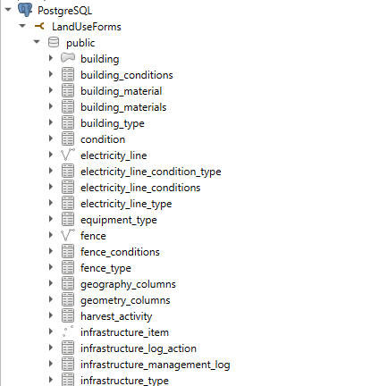
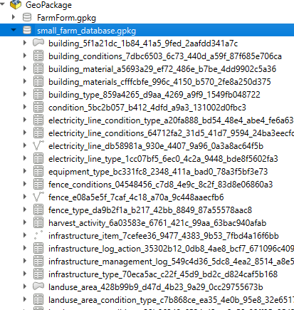
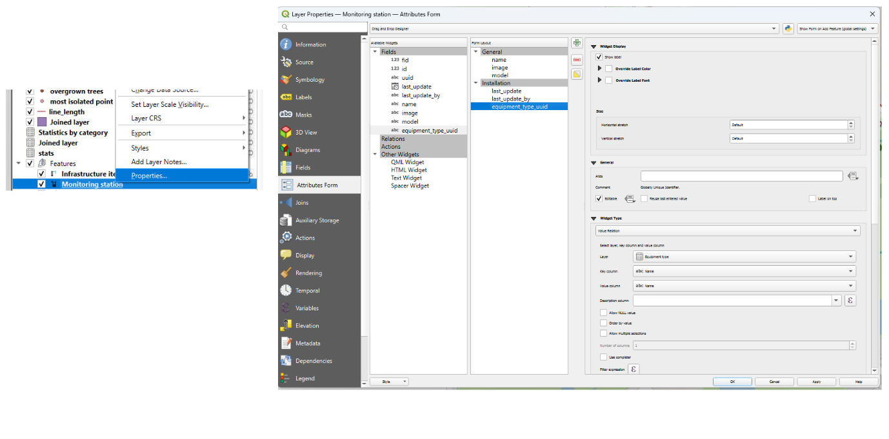
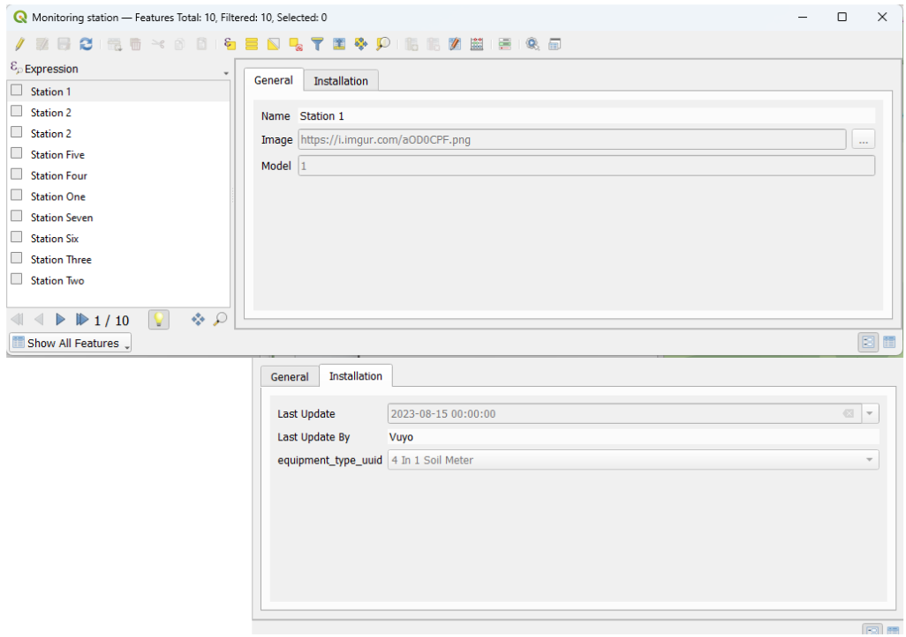

# Interactive Tutorial: Creating Forms in QGIS

**Objective 1:** Learn how to create custom attribute forms in QGIS.
- **Objective 2:** Learn how to import data from database
- ## Step 1: Open QGIS and Load Your Data
- Launch the QGIS software on your computer.
- Load the vector layer you want to create a form for.
- 
	-
- The tables that create layers are added from PostgreSQL. Which is the database used.
	- Forms are then exported for offline editing in the GeoPackage as seen below, via drag and drop.
	  
	-
- You can drag and drop the file into QGIS or use the "Add Vector Layer" option.
- ## Step 2: Open Layer Properties
- Right-click on the layer in the "Layers" panel and select "Properties."
- ## Step 3: Access Attribute Form
- In the Layer Properties dialog, go to the "Attributes Form" section.
- ## Step 4: Enable Custom Form
- Check the "Provide custom attribute form" option to enable creating a custom form for the layer.
- ## Step 5: Edit Widget Type
- For each field in the attribute table, select the desired widget type:
	- Text box, drop-down list, etc.
- ## Step 6: Configure Widget Options
- Depending on the widget type, configure its options:
	- Set values for a drop-down list or choose the date format for a date picker.
- ## Step 7: Arrange Widgets
- Organize the widgets' order in the form:
	- Use the up and down arrows next to each field.
	- {:height 378, :width 748}
	-
- ## Step 8: Set Visibility Rules (Optional)
- Define visibility rules based on conditions:
	- Show or hide fields based on the value of another field.
- ## Step 9: Apply and Save
- Click "OK" in the Layer Properties dialog to apply your changes.
- ## Step 10: Open Attribute Form
- While editing, select a feature and click "Open Form" in the Attributes toolbar:
	- Alternatively, right-click the feature and choose "Open Form."
- ## Step 11: Edit Attributes
- Use the custom form to edit the selected feature's attributes.
- ## Step 12: Save Edits
- After editing, click "Save Edits" in the Attributes toolbar to save your changes.
- 
-
- ## Step 14: Close the Form
- When finished, close the form by clicking "Close Form" in the Attributes toolbar.
  
  **Congratulations!** You've successfully created a custom attribute form for your layer in QGIS. You can now efficiently edit and manage your geographic data.
-