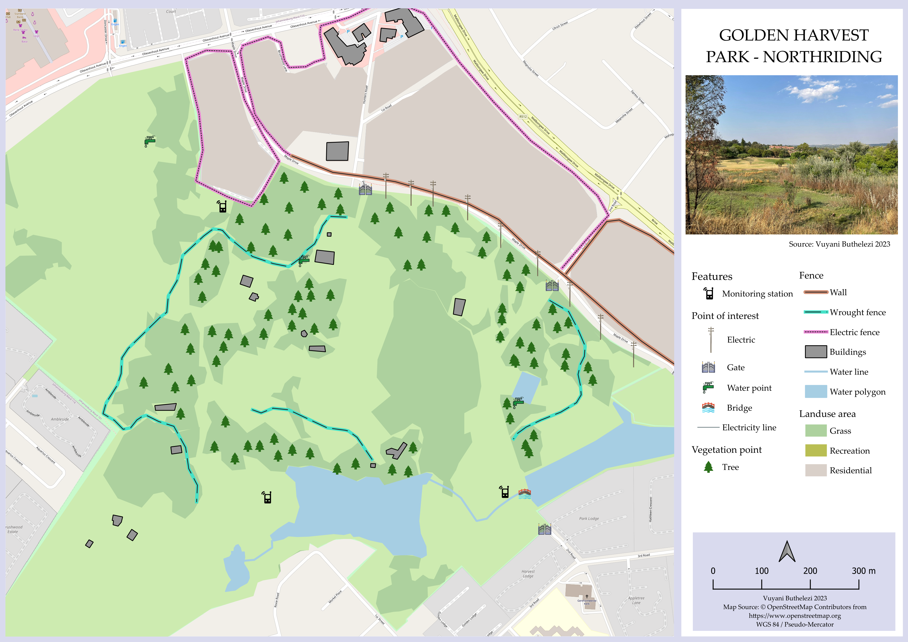

# Creating and Styling a Map Layout in QGIS
- **Introduction:**
  In QGIS, you can create and style map layouts to effectively present geographic data.
- **Preparation:**
	- Launch QGIS and load the relevant data layers for your map layout.
- **Access Print Layout Manager:**
	- Go to the "Project" menu and select "New Print Layout" to open the Print Layout Manager.
- **Add Map to Layout:**
	- Click "Add Item," choose "Add Map," and define the map's extent by drawing a rectangle on the canvas.
- **Style the Map:**
	- Double-click the added map to access "Item Properties."
	- Adjust the map's appearance, frame style, background color, and other settings in the "Main properties" section.
- **Enhance Layout:**
	- Add legends, text labels, titles, and annotations using the "Add Item" button.
	- Customize the legend's appearance and content through "Legend Properties."
	- 
- **Export or Print:**
	- Export the final layout as an image or PDF using the Print Layout Manager's export options.
- **Save Layout Template:**
	- Save your layout template for future use and modifications.
- **Conclusion:**
  Creating and styling map layouts in QGIS empowers you to produce visually appealing maps for reports, presentations, or publications, effectively conveying geographic insights.
- Creating layout for the map
- 
-
-