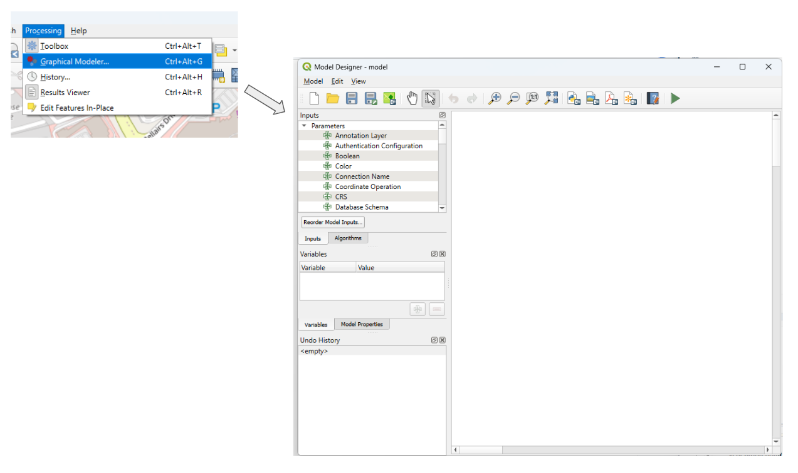
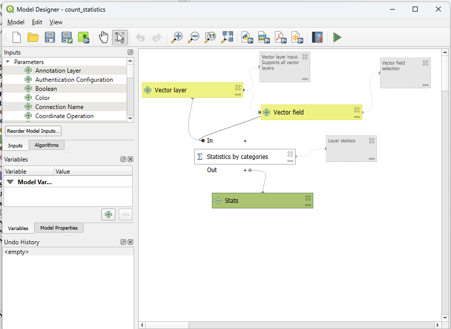
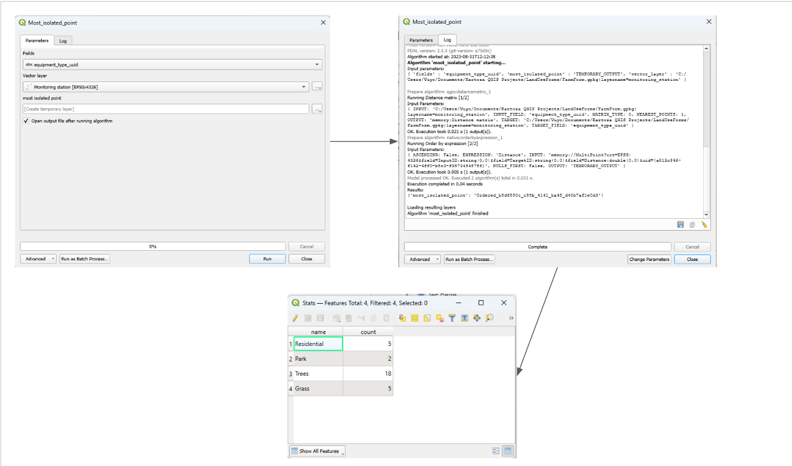
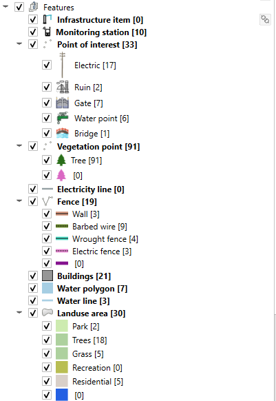
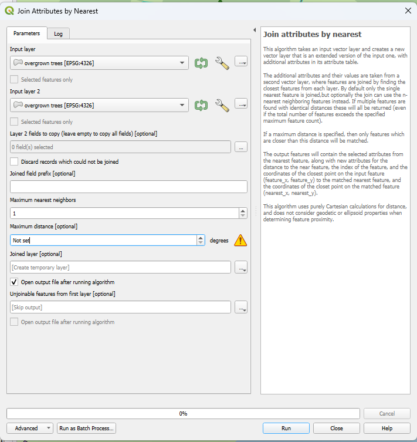
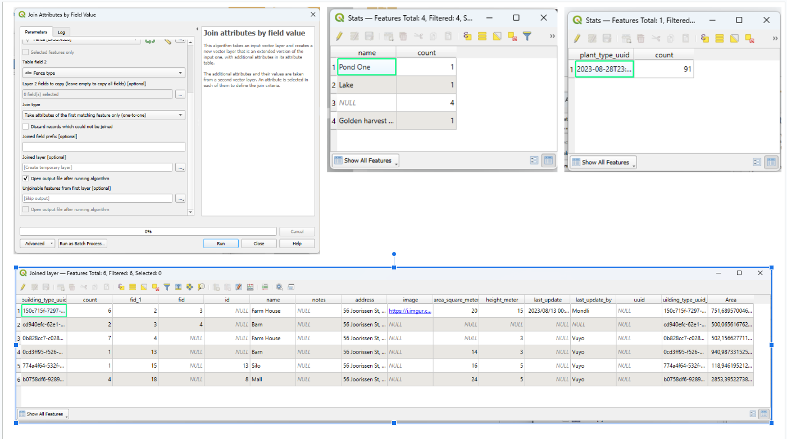

-
-
- # Spatial Analysis in QGIS Day 1
- **Introduction:**
  In QGIS, you can create and style map layouts to effectively present geographic data.
- # Spatial Analysis: (1) Counting Points per Category
- ## Step 1: Load Data
- Open QGIS and load the layer containing your points data.
- ## Step 2: Access Processing Toolbox
- In QGIS, go to the "Processing" menu and select "Toolbox" to open the Processing Toolbox.
- 
- ## Step 3: Use the "Count Points in Polygon" Algorithm
- In the Processing Toolbox, search for "Count Points in Polygon" algorithm and double-click it to open the tool.
- ## Step 4: Configure the Tool
- Select your points layer as the "Point layer" input.
- If you have a polygon layer that categorizes the areas, use it as the "Polygon layer" input.
- Choose the appropriate fields for "Point ID" and "Polygon ID" based on your data.
- Set the "Counts field name" to a name that describes the count data (e.g., "Point_Count").
- 
- ## Step 5: Run the Tool
- Click "Run" to execute the algorithm.
- 
- ## Step 6: Analyze Results
- Once the tool completes, a new layer will be added to the Layers panel.
- Open the attribute table of this layer to see the results.
- You'll find a "Point_Count" field that shows the count of points for each polygon category.
- 
- ### Most Points: Vegetation Point (91)
- ### Least Points: Water Line (3)
-
- ## Step 7: Join Data (Optional)
- If you want to display this information on your original polygon layer:
	- Open the polygon layer's attribute table.
	- Perform a table join with the count layer using a common field (e.g., "Polygon ID").
	- This will add the count information to your original polygon layer.
	- {:height 761, :width 711}
- ## Joined Data looks like:
	- 
	-
- ## Step 8: Styling (Optional)
- Customize the styling of your polygon layer to visualize the point counts per category. For example, you can use graduated colors or size-based symbols to represent the count values.
- ## Step 9: Save Project and Export
- Save your QGIS project to preserve your analysis setup.
- If desired, you can export the styled map as an image or PDF for documentation.