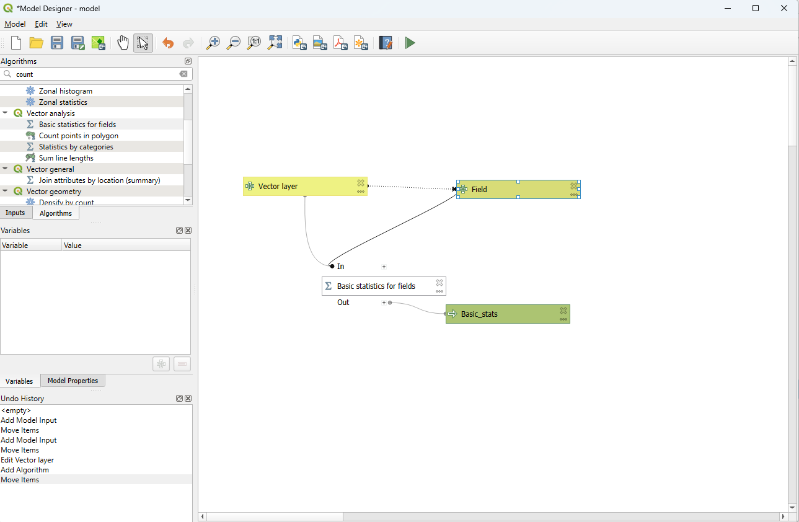

# Spatial Analysis in QGIS Day 1
- ### All the models used
-
- ### Model - Basic Stats
- 
- ### Model - Most Isolated Points
- 
- ### Model - Features within Distance
- 
- ### Model - Line Length
- 
-
-
- # Spatial Analysis: Area and Length Calculations
- ## 2. Calculating Area for Polygons
- ### Step 1: Load Data
- Open QGIS and load the layer containing your polygon features.
- ### Step 2: Access Field Calculator
- Right-click on the layer and choose "Open Attribute Table."
- Click the "Field Calculator" button to open the Field Calculator dialog.
- ### Step 3: Calculate Area
- Create a new field for area calculation.
- Use the expression `$area` in the Field Calculator to calculate the area for each polygon.
- ### Step 4: Summarize Results
- After calculating areas, you can open the attribute table and see the calculated areas for each polygon.
- Use the "Group Stats" tool if you want to calculate the total area per category.
- 
- 
-
-
- ## 3. Calculating Length for Line Features
- ### Step 1: Load Data
- Load the layer containing your line features.
- ### Step 2: Access Field Calculator
- Open the attribute table for the line layer.
- Click the "Field Calculator" button to open the Field Calculator dialog.
- ### Step 3: Calculate Length
- Create a new field for length calculation.
- Use the expression `$length` in the Field Calculator to calculate the length for each line.
- ### Step 4: Summarize Results
- After calculating lengths, open the attribute table to see the calculated lengths for each line feature.
- Use the "Group Stats" tool if you want to calculate the total length per category.
- 
-
- ## Most Dominant Feature
- 
- ### Vegetation Point: (91)