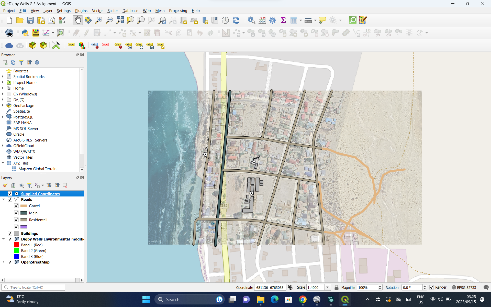

# To create a map with a georeferenced image background in QGIS using the supplied coordinates, I followed these steps:
- ## Obtain the Georeferenced Image
	- Open Google Earth and navigate to the area where the coordinates are located.
	- Once you have the area in view, go to "File" -> "Save" -> "Save Image."
	- In the "Save Image" window, choose the "Save as type" option to be "JPEG."
	- 
	- Make sure you select the "Maximum zoom" level for the best quality.
	- Save the image to a location on your computer.
- ## Install the Georeferencer Plugin
	- Open QGIS and ensure you have the Georeferencer GDAL plugin installed. You can install it by going to "Plugins" -> "Manage and Install Plugins" and searching for "Georeferencer GDAL."
	- 
	- 
	-
- ## Load the Image into QGIS
	- Go to "Layer" -> "Add Raster Layer."
	- Browse and select the georeferenced image (JPEG) you obtained from Google Earth.
- ## Open the Georeferencer Plugin
	- Go to "Raster" in the top menu, and you should see "Georeferencer" in the dropdown menu. Click on it to open the Georeferencer plugin.
- ## Georeference the Image
	- In the Georeferencer plugin window, click on the "Open Raster" button and select the image you loaded into QGIS.
	- Use the "Add Point" button to add control points on the image that correspond to known points on the map (e.g., road intersections, landmarks).
	- Enter the corresponding UTM coordinates (Easting and Northing) for each control point.
	- Once you have enough control points, click on the "Start Georeferencing" button. QGIS will create a world file (.wld) associated with your image.
	- 
	-
- ## Set Project CRS
	- In QGIS, make sure your project's Coordinate Reference System (CRS) matches the UTM zone and datum used for your coordinates (WGS 84, UTM Zone 33S). You can set this in the project properties.
	- 
	-
- ## Load the Coordinates
	- Load the coordinates you want to plot as points. You can use a CSV file with the Easting and Northing columns.
- ## Plot the Coordinates
	- Use the "Add Delimited Text Layer" option to load your CSV file.
	- Set the X field to Easting and the Y field to Northing.
	- The points representing your coordinates should now be displayed on top of the georeferenced image.
	- 
	-
- ## Export the Map
	- Once everything is in place, you can export the map to a JPG or other desired format by going to "Project" -> "Import/Export" -> "Export Map to Image."
	   
	  Ensure that you maintain the correct UTM zone (33S) throughout this process to ensure accurate georeferencing.