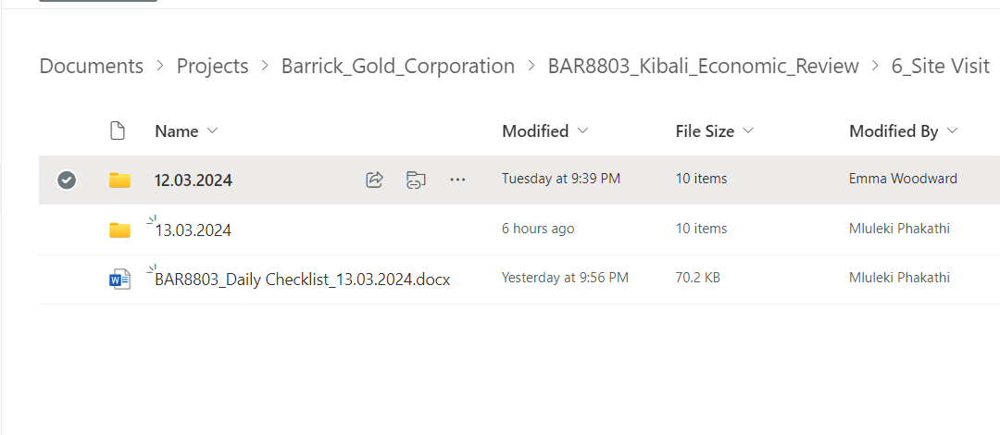
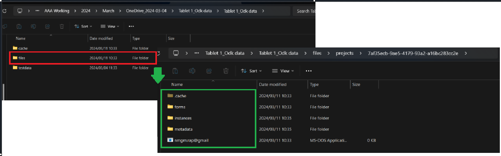

# Guide on How to Develop the Data Template for Data Management Projects
	- There are different ways on how data can be done. It depends on how the data was collected. Data can be collected using the Kobotoolbox and then collected via ODK Briefcase. It can also be collected using google drive. This guide will follow data that was  collected via ODK Briefcase.
	- ## 1. Downloading Data
		- Download data from the source: In this case it is in a **SharePoint** folder
		- 
		- Data when downloaded will be in a CSV format and from there the data needs to be consolidated into one folder.
	- ## Data Consolidation
		- First the data must be extracted from the ZIP file and then consolidated into one folder.
		- 
		- The address of the folder should be in this path:
			- ``...\Tablet 1_Odk data\files\projects\7af35ecb-9ae5-4179-93a2-a16bc283cc2e``
		-